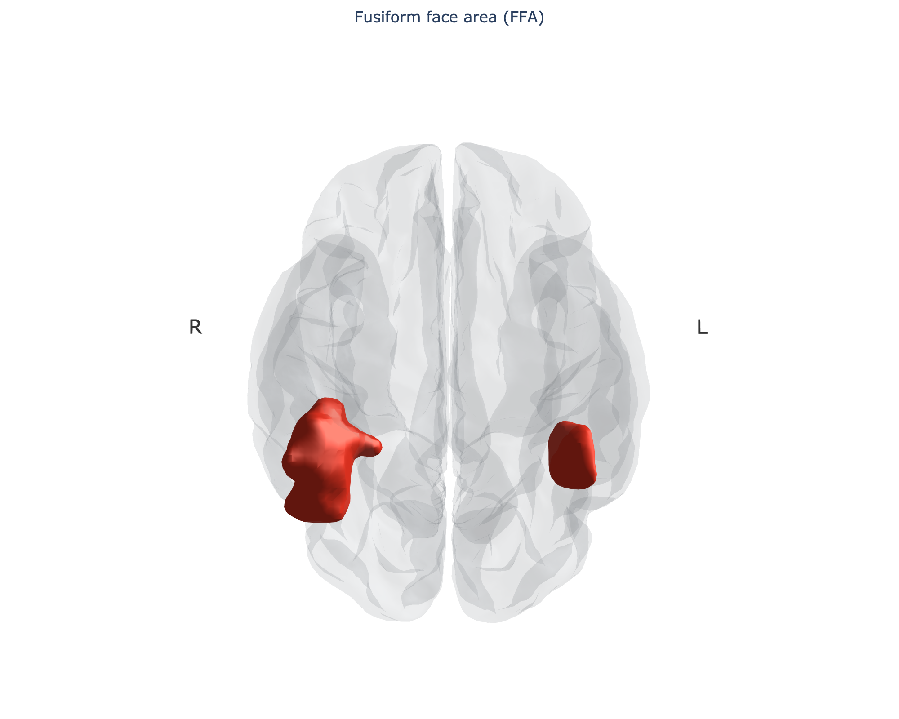
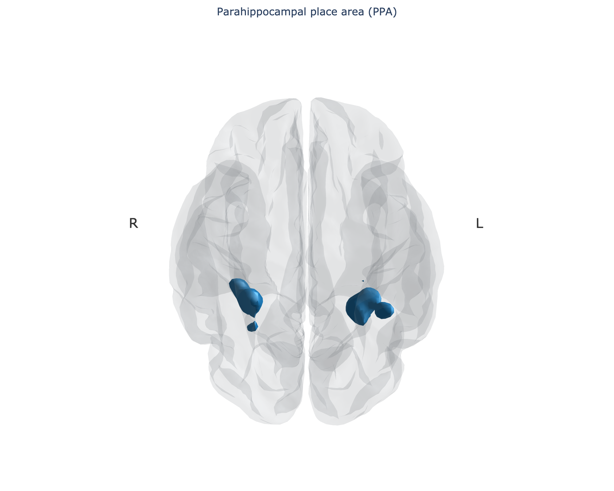

# Public-domain images of the FFA and PPA

[](https://colab.research.google.com/github/maierav/ffa-ppa-public-domain/blob/main/ffa_ppa_public_domain.ipynb)

Reproducible figures showing the location of the **fusiform face area (FFA)** and the
**parahippocampal place area (PPA)** on a human brain, built only from inputs whose licenses
allow the resulting images to be released into the public domain (CC0).

| FFA | PPA |
|---|---|
|  |  |

## How the regions are defined

1. Meta-analytic **association-test z-maps** for the terms *fusiform face* (143 studies) and *place* (189 studies)
   are downloaded from [Neurosynth](https://neurosynth.org) (data are CC0). These maps are already
   FDR-thresholded at q = 0.01.
2. The **largest suprathreshold cluster in each hemisphere** is taken as the region. This isolates the FFA and PPA
   proper; the full maps also contain the occipital face area, amygdala, retrosplenial and occipital place areas.
3. Figures are rendered with [Nilearn](https://nilearn.github.io), scikit-image and Plotly on the FreeSurfer
   fsaverage surfaces and the MNI152 template.

| Region | Threshold | Left peak (MNI) | Right peak (MNI) |
|---|---|---|---|
| FFA | z > 6 | −40, −52, −20 (z = 19.7) | 42, −50, −24 (z = 24.1) |
| PPA | z > 4 | −28, −46, −10 (z = 11.1) | 28, −44, −14 (z = 8.5) |

A note on the hemispheric asymmetries visible in the figures. The FFA cluster is about three times larger on the
right than on the left (1532 vs 493 voxels after cutting the occipital face area off at y = −70; without that cut the
right cluster also absorbs the OFA). Right-larger FFA is a real and well-replicated finding, and here it is a property
of the meta-analytic map itself, not of the clustering. The left-stronger PPA in the *place* map is within what one
expects from a 189-study meta-analysis and should not be over-interpreted. See the `*_with_context` figures for
everything else the maps contain.

## Contents

- `ffa_ppa_public_domain.ipynb` — the whole pipeline, executed, Colab-ready (installs pinned dependencies in the first cell)
- `viewer/ffa_ppa_viewer.html` — interactive 3D viewer template (see below); `viewer/meshes.js` is written by the notebook
- `ffa_ppa_output/ffa_ppa_viewer_standalone.html` — the viewer with the meshes embedded, open it in any browser
- `ffa_ppa_output/figures/` — per region: glass-brain isosurface (ventral and oblique PNG, rotatable HTML), the same with
  the map's other clusters shown faintly, turntable GIF, inflated-surface views per hemisphere, MNI slices at the peaks
- `ffa_ppa_output/data/` — the two Neurosynth maps and 2 mm MNI152 masks of each region (`*_mask_MNI152_2mm.nii.gz`),
  loadable in MRIcroGL, FSLeyes, 3D Slicer, etc.

## Interactive viewer and movies

Open `ffa_ppa_output/ffa_ppa_viewer_standalone.html` in a browser (needs internet access for plotly.js from its CDN).
It lets you rotate and zoom, switch regions on and off, change colors, set the transparency of the cortex and the
regions, switch to a black background, jump to camera presets, save a PNG of the current view, copy the current camera
as JSON (paste it into `VIEWS` or `ORBIT` in the notebook to reproduce the view), and record a turntable GIF in the
browser with a chosen spin axis, elevation, distance, frame count, and size.

The notebook also renders a turntable GIF per region (`figures/*_turntable.gif`). Convert to MP4 with

```bash
ffmpeg -i ffa_ppa_output/figures/FFA_turntable.gif -movflags faststart -pix_fmt yuv420p FFA_turntable.mp4
```

## Running it

Open in Colab with the badge above, or locally:

```bash
pip install -r requirements.txt
jupyter notebook ffa_ppa_public_domain.ipynb
```

Runs in about one minute. Set `SURF_MESH = "fsaverage"` in the config cell for high-resolution surface renders.

## License and attribution

Everything in this repository is released under **CC0 1.0** (see `LICENSE`). Licenses of the inputs:

| Input / tool | License |
|---|---|
| Neurosynth term maps (Yarkoni et al. 2011, *Nat Methods*) | CC0 |
| fsaverage surfaces (FreeSurfer, via Nilearn) | FreeSurfer license, free to use |
| MNI152 template (via Nilearn) | MNI permissive notice |
| Nilearn, nibabel, scikit-image, Plotly, matplotlib | BSD / MIT |

Suggested caption: *Location of the fusiform face area (red) / parahippocampal place area (blue), defined as the largest
cluster per hemisphere in the Neurosynth association-test map for the term "fusiform face" / "place" (FDR q < 0.01, FFA restricted to y ≥ −70 to exclude the OFA),
rendered on the FreeSurfer fsaverage surface in MNI space. Data: Neurosynth, CC0.*
